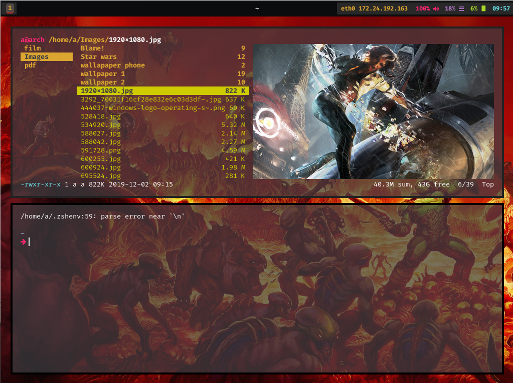
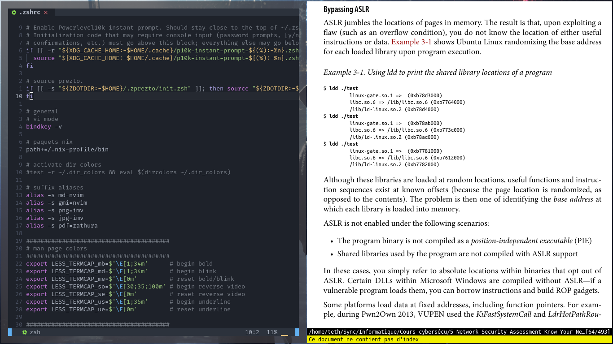
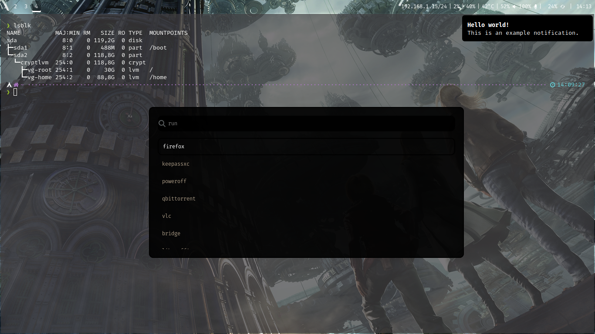
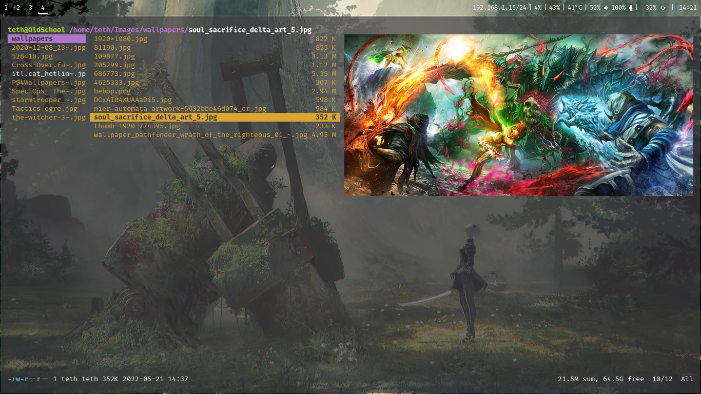

# dotfiles

Setup de laptop pour ArchLinux.  
Minimaliste, renforcé et moderne. 

Sécurité :

- kernel : linux-hardened en lockdown
- Chiffrement : / et /home sous partition LUKS
- MAC : AppArmor
- Firewall : Firewalld
- blacklisting de plusieurs modules de kernel et hardening de divers paramètres du kernel en plus
- maj du microcode automatique
- renforcement des paramètres de boot
- malloc renforcé, appliqué pour l'ensemble du système

Eléments principaux :
  
- Gestionnaire de fenêtre: sway
- Bar de status: waybar (désactivable, on peut mettre les infos dans le terminal au niveau de powerlevel10k)
- Lanceur d'application: wofi
- Daemon de notification: mako
- Ecran de verouillage: swaylock-effect
- Police de caractère: FiraCode Nerd Font
  
Apps :
  
- Terminal: kitty
- Shell: zsh avec prezto, spaceship et powerlevel10k
- Gestionnaire de fichier: ranger
- Editeur de texte: AstroNvim
- Traitement de texte: libreoffice
- Moniteur système: htop
- Visionneuse de documents: zathura  
- Visionneuse d'image: imv
- Lecteur multimédia: mpv
- Gestionnaire de mot de passe: KeePassXC
- Navigateur: firefox
- Chiffrement DNS: dnscrypt-proxy

=> [installation de a à z](installation.txt)

=> [liste des commandes](cheatsheet.txt)

