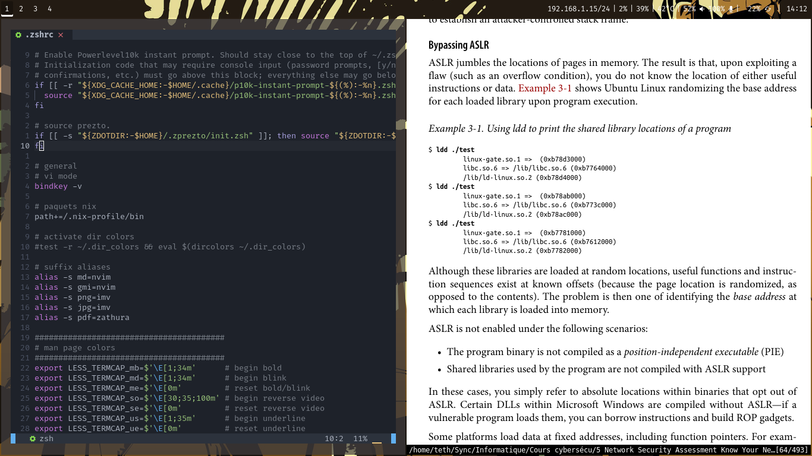

# dotfiles

Mon envionnement de travail ArchLinux sous Wayland.  
Minimaliste, simple et efficace. 

Eléments principaux:
  
- Gestionnaire de fenêtre: sway
- Bar de status: waybar
- lanceur d'application: wofi
- Daemon de notification: mako
- Ecran de verouillage: swaylock-effect
- Police de caractère: FiraCode Nerd Font
  
Utilitaires:
  
- Terminal: kitty
- shell: zsh avec prezto et spaceship
- Gestionnaire de fichier: ranger
- Navigateur: firefox
- Editeur de texte: neovim
- Traitement de texte: libreoffice
- moniteur système: htop
- Visionneuse de documents: zathura  
- Visionneuse d'image: imv
- Lecteur multimédia: mpv
- Client mail: neomutt
- Clendrier: Khal
- to-dos: todoman

Todo: configurer neovim

