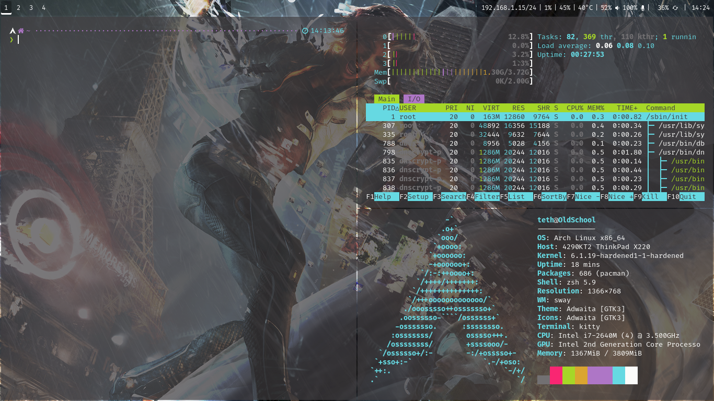

# dotfiles

Mon envionnement de travail ArchLinux sous Wayland.  
Minimaliste, simple et efficace. 

Eléments principaux:
  
- Gestionnaire de fenêtre: sway
- Bar de status: waybar
- Lanceur d'application: wofi
- Daemon de notification: mako
- Ecran de verouillage: swaylock-effect
- Police de caractère: FiraCode Nerd Font
  
Utilitaires:
  
- Terminal: kitty
- Shell: zsh avec prezto et spaceship
- Gestionnaire de fichier: ranger
- Navigateur: firefox
- Editeur de texte: neovim
- Traitement de texte: libreoffice
- Moniteur système: htop
- Visionneuse de documents: zathura  
- Visionneuse d'image: imv
- Lecteur multimédia: mpv
- Client mail: neomutt
- Clendrier: Khal
- To-dos: todoman

Todo: 
    configurer neovim, neomutt, todoman et khal.  
    corriger les erreurs zshenv et zshrc  

[installation de a à z](installation.txt)

